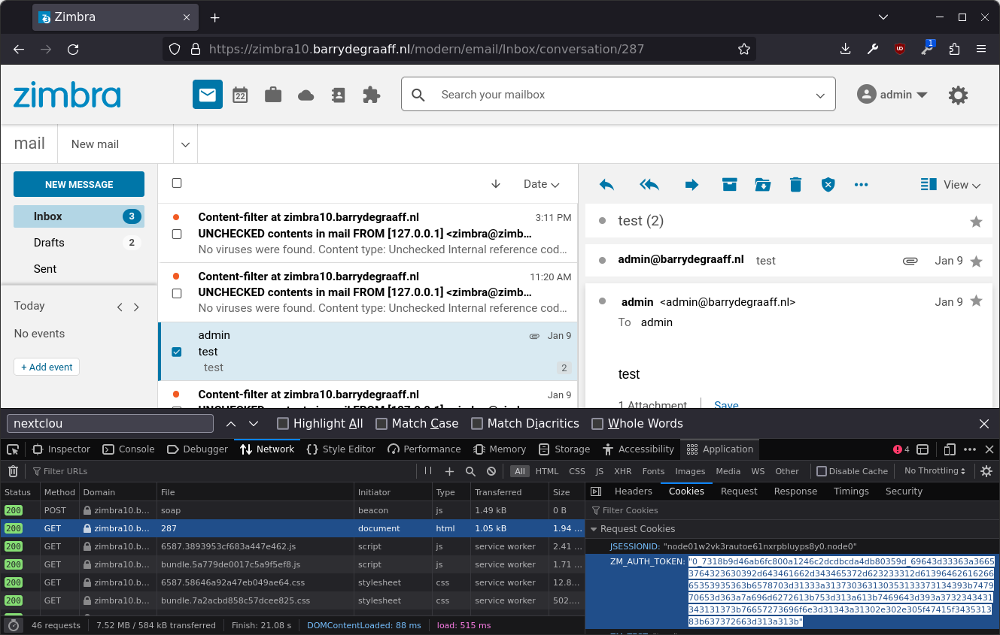

# zm-nextcloud-extension

This is the back end for Nextcloud Zimlet Modern UI, see also: https://github.com/Zimbra/nextcloud-zimlet. Below documentation should only be used for troubleshooting, follow the admin guide for installation and set-up guidance!

## Compiling

Use https://github.com/Zimbra/zm-build this extension depends on `zm-oauth-social-common` and if you make changes to `zm-oauth-social-common` you need to run `ant publish-local` to make sure the updated version of `zm-oauth-social-common` can be used by zm-nextcloud-extension.

## Troubleshooting saving email/attachments from Zimbra to Nextcloud

In a rare case a partner that had experienced issues upgrading Zimbra Proxy from Zimbra 8 to 10, later on had issues saving emails/attachments from Zimbra to Nextcloud. In addition  the partner relies on alias domains.

Every time an attachment or email is stored into Nextcloud, there will be a log line in the Zimbra mailbox log. You can find the relevant logs by running a tail on the log file while trying to save to Nextcloud:

```
tail -f /opt/zimbra/log/mailbox.log | grep -i nextcloud
```

An example log would look like this:

```
2024-01-22 15:15:10,010 INFO  [qtp921760190-146:https://zimbra10.barrydegraaff.nl:8443/service/soap/ModifyDataSourceRequest] [name=admin@barrydegraaff.nl;mid=2;ip=192.168.1.98;port=43892;ua=zclient/10.0.6_GA_4585;soapId=2fbf73d2;] datasource - Updating schedule for data source info@barrydegraaff.tk-noop-nextcloud
2024-01-22 15:15:13,879 INFO  [qtp921760190-144:https://zimbra10.barrydegraaff.nl/service/extension/nextcloud] [] extensions - Refresh token :E8CBrO4Dl4U7YmG0uTSofSIYEPtmRD9MmcWNPkeQjwIsBBlOd77L6v0rM6lNusgCiWRUxJR6 zimbra10.barrydegraaff.nl
2024-01-22 15:15:15,636 INFO  [qtp921760190-143:https://zimbra10.barrydegraaff.nl/service/extension/nextcloud] [] extensions - Refresh token :4XoqkZcggorUVvy768zTzEtTmXAfPdP4qPKfhkTYbKrzPIX7SBdyShoKTixB9Rzr11BT9ONK zimbra10.barrydegraaff.nl
2024-01-22 15:15:15,639 INFO  [qtp921760190-143:https://zimbra10.barrydegraaff.nl/service/extension/nextcloud] [] extensions - PUT action
2024-01-22 15:15:15,641 INFO  [qtp921760190-143:https://zimbra10.barrydegraaff.nl/service/extension/nextcloud] [] extensions - req.getServerName(): zimbra10.barrydegraaff.nl, server.getName():zimbra10.barrydegraaff.nl
2024-01-22 15:15:15,642 INFO  [qtp921760190-143:https://zimbra10.barrydegraaff.nl/service/extension/nextcloud] [] extensions - Local config nextcloud_zimlet_zimbra_hostname_override: 
2024-01-22 15:15:15,642 INFO  [qtp921760190-143:https://zimbra10.barrydegraaff.nl/service/extension/nextcloud] [] extensions - https://zimbra10.barrydegraaff.nl:8443//service/home/~/?auth=co&id=286&part=2&disp=a
2024-01-22 15:15:17,540 INFO  [qtp921760190-145:https://zimbra10.barrydegraaff.nl/service/extension/nextcloud] [] extensions - Refresh token :khsTmeamfVVe2vfzNJyA6S1DSdD9pkvQz2GB1fNK6JVI4Pvo3TrxABi4pehSieQaXTgjWiOS zimbra10.barrydegraaff.nl
2024-01-22 15:15:18,720 INFO  [qtp921760190-144:https://zimbra10.barrydegraaff.nl/service/extension/nextcloud] [] extensions - Refresh token :ql5ReuDIsSME24fL1kkiOyx1TCF85H10lBf5MDtQqmf0Ot8NEqhddffKw52kwg6AgeRd801e zimbra10.barrydegraaff.nl
2024-01-22 15:15:18,722 INFO  [qtp921760190-144:https://zimbra10.barrydegraaff.nl/service/extension/nextcloud] [] extensions - PUT action
2024-01-22 15:15:18,724 INFO  [qtp921760190-144:https://zimbra10.barrydegraaff.nl/service/extension/nextcloud] [] extensions - req.getServerName(): zimbra10.barrydegraaff.nl, server.getName():zimbra10.barrydegraaff.nl
2024-01-22 15:15:18,725 INFO  [qtp921760190-144:https://zimbra10.barrydegraaff.nl/service/extension/nextcloud] [] extensions - Local config nextcloud_zimlet_zimbra_hostname_override: 
2024-01-22 15:15:18,725 INFO  [qtp921760190-144:https://zimbra10.barrydegraaff.nl/service/extension/nextcloud] [] extensions - https://zimbra10.barrydegraaff.nl:8443/service/home/~/?auth=co&id=286&disp=a
2024-01-22 15:15:18,870 INFO  [qtp921760190-144:https://zimbra10.barrydegraaff.nl/service/extension/nextcloud] [] extensions - https://zimbra10.barrydegraaff.nl:8443//service/home/~/?auth=co&id=286&part=2&disp=a

```

If you look closely you will see that the URL to the items to be stored in Nextcloud are shown in the log. In this case:

- https://zimbra10.barrydegraaff.nl:8443/service/home/~/?auth=co&id=286&disp=a
- https://zimbra10.barrydegraaff.nl:8443//service/home/~/?auth=co&id=286&part=2&disp=a

Normally the mailbox server will not have issues connecting to port 8443 or having that `//` instead of `/`. However the setting of `zimbraPublicServiceHostname`, `zimbraPublicServicePort` and `zimbraPublicServiceProtocol` should be set correctly:

```
zmprov mcf zimbraPublicServiceProtocol https
zmprov mcf zimbraPublicServicePort 443
zmprov mcf zimbraPublicServiceHostname your.zimbra.example.com
zmmailboxdctl restart
```

You can validate your configuration using `curl` command:

```
curl -v --cookie "ZM_AUTH_TOKEN=0_0..put cookie value here.a313b" "https://zimbra10.barrydegraaff.nl:8443//service/home/~/?auth=co&id=286&part=2&disp=a" -o my.pdf
head my.pdf
```
You can get the ZM_AUTH_TOKEN via the browsers developer console:



If you are unable to configure Zimbra in such a way that the Nextcloud extension can fetch the email/attachments you can override the `zimbraPublicServiceHostname` by setting the `nextcloud_zimlet_zimbra_hostname_override` local config. Open the file `/opt/zimbra/conf/localconfig.xml` and add the following:

```
  <key name="nextcloud_zimlet_zimbra_hostname_override">
    <value>https://workingZimbraDomain.example.com</value>
  </key>
```
You can include the port number as well if needed. After adding the local config, restart mailbox using `zmmailboxdctl restart`.

## Available localconfig parameters

You can tweak some of the settings from this integration by changing localconfig parameters. This table describes all the ones available. You must restart Zimbra mailbox for changes to be applied. As user zimbra run `zmmailboxdctl restart`.

In 99% of cases these localconfig parameters are unnecessary.

|  localconfig | required  | default | description |
|---|---|---|---|
| nextcloud_zimlet_zimbra_hostname_override  | no | unset | URL to your Zimbra server if differs from zimbraPublicServiceHostname (see above) |
| nextcloud_zimlet_debug                     | no | false | Turns on logging of OAuth refresh token en stack dumps to zmmailboxd.out |
| nextcloud_request_timeout                  | no | 15000 | Allows setting setConnectTimeout, setConnectionRequestTimeout and setSocketTimeout from ZimbraHttpConnectionManager |

